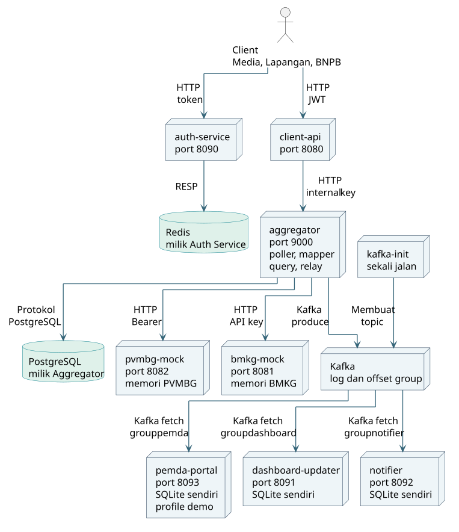

# AkuAnakTehat

Platform koordinasi kebencanaan BNPB untuk **IF4031 Arsitektur Aplikasi Terdistribusi, Milestone 1**. Sistem menggabungkan informasi gempa dan potensi tsunami dari BMKG dengan laporan aktivitas vulkanik dari PVMBG, menyajikannya sesuai hak akses pengguna, serta menyalurkan perubahannya kepada consumer independen.

Kedua instansi berupa mock dengan data sintetis. Implementasi mencakup polling, pemetaan data kanonik, autentikasi, API baca, distribusi event, dan pengujian gangguan serta pemulihan. Ini merupakan PoC lokal pada satu host dengan delapan service aplikasi ketika Pemda Portal diaktifkan.

## Arsitektur



Diagram berasal dari [PlantUML yang dapat diedit](docs/laporan/diagrams/01-arsitektur.puml). Setiap kotak dan simbol database menunjukkan satu container. SQLite dan memori mock berada dalam container pemilik. Panah dari Kafka menunjukkan aliran data menuju consumer yang menginisiasi pembacaan melalui protokol Kafka.

Sistem memisahkan tiga alur agar kegagalan sumber tidak langsung menghambat pembacaan pengguna.

1. **Pengambilan data.** Worker Aggregator mengambil JSON dari BMKG dan PVMBG secara independen, memvalidasi field wajib, mempertahankan atribut tambahan, dan memetakan data ke `HazardEvent`. Warning tsunami dikorelasikan dengan gempa terkait. Hazard dan outbox disimpan atomik per record. Checkpoint maju setelah seluruh respons polling ditangani; retry memakai hash untuk menghindari duplikasi.
2. **Pembacaan data.** Client memperoleh JWT dari Auth Service, kemudian mengakses Client API. Setelah memeriksa token, hak akses, dan batas beban, Client API memanggil API internal Aggregator. Data dibaca dari Canonical Store sehingga request pengguna tidak menunggu HTTP sumber. Media memperoleh ringkasan; Tim Lapangan dan BNPB Pusat boleh membaca data mentah. Status sumber membantu pengguna menilai kebaruan data.
3. **Distribusi perubahan.** Relay mengirim snapshot outbox ke Kafka dan menandai publish setelah ACK. Dashboard Updater, Notifier, dan Pemda Portal memakai consumer group serta SQLite masing-masing. Consumer yang berhenti dapat melanjutkan pembacaan selama pesannya masih tersedia dalam retensi broker.

### Tanggung jawab service

| Service | Tanggung jawab | Penyimpanan | Akses default |
| --- | --- | --- | --- |
| [BMKG Mock](services/bmkg-mock/README.md) | Gempa, warning tsunami, seed, generator, dan API key | Memori lokal | `127.0.0.1:8081` |
| [PVMBG Mock](services/pvmbg-mock/README.md) | Vulkanik, perubahan skema, delay, dan outage | Memori lokal | `127.0.0.1:8082` |
| [Aggregator](services/aggregator/README.md) | Polling, pemetaan, korelasi, transaksi, query, dan relay | Pemilik PostgreSQL | `aggregator:9000`, internal |
| [Client API](services/client-api/README.md) | JWT, scope, proyeksi, filter, pagination, dan proteksi beban | Tidak persisten | `127.0.0.1:8080` |
| [Auth Service](services/auth-service/README.md) | Access token dan rotasi refresh token | Pemilik Redis | `127.0.0.1:8090` |
| [Dashboard Updater](services/dashboard-updater/README.md) | View hazard versi terbaru | SQLite sendiri | `127.0.0.1:8091/view` |
| [Notifier](services/notifier/README.md) | Simulasi alert SIAGA dan AWAS serta deduplikasi | SQLite sendiri | `127.0.0.1:8092/processed` |
| [Pemda Portal](services/pemda-portal/README.md) | Subscriber tambahan tanpa perubahan producer | SQLite sendiri | `127.0.0.1:8093/view`, profile `demo` |

Setiap service memiliki module Go dan Dockerfile sendiri. Client API tidak mengakses PostgreSQL langsung. Consumer membaca Kafka, sedangkan Auth Service mengelola sesi di Redis. Poller, mapper, query, dan relay tetap menjadi komponen Aggregator karena menggunakan data dan transaksi milik service tersebut.

PostgreSQL berada pada `store_net`, Redis pada `auth_net`, dan Kafka pada `bus_net`. Ketiganya tidak memublikasikan port ke host. Port HTTP operator hanya terikat ke loopback. Detail kontrak tersedia pada [HTTP internal](docs/api/aggregator-http.md), [API client](docs/api/client-http.md), [storage](docs/api/storage.md), [event](docs/api/hazard-event.md), dan [indeks kontrak](docs/api/README.md).

## Teknologi dan alasan pemilihan

| Teknologi | Penggunaan dan alasan |
| --- | --- |
| Go 1.24.2 | Goroutine untuk worker independen dan `context` untuk deadline; module terpisah menjaga build setiap service. |
| HTTP, JSON, dan `net/http` | Kontrak mudah diperiksa; tolerant reader menerima atribut baru sambil memvalidasi field wajib. |
| PostgreSQL 16.8, JSONB, dan pgx | Transaksi menyatukan hazard, watermark, dan outbox. Kolom kanonik bertipe mendukung filter; atribut tambahan tidak membutuhkan DDL baru. |
| golang-migrate | Migrasi tabel berversi yang di-embed dan dijalankan Aggregator. |
| Redis 7.4.2, AOF, dan Lua | TTL sesi, persistensi refresh token, dan rotasi state secara atomik di Redis. |
| JWT EdDSA dengan Ed25519 | Auth Service memegang private key; Client API memverifikasi dengan public key tanpa meminta auth pada setiap request. |
| Apache Kafka 3.9.1 dan franz-go | Retensi event dan offset per group mendukung subscriber independen serta replay. |
| SQLite melalui modernc | View dan deduplikasi lokal tanpa menambah server database untuk setiap consumer. |
| Docker Compose | Mengatur container, network, volume, serta health check bersama. |
| k6 0.57.0 | Mengukur latency, throughput, error, serta penolakan beban. Koneksi TCP diukur terpisah dari VU. |
| LaTeX, PlantUML, dan Tectonic | Laporan modular, diagram berbasis teks, dan PDF yang dapat dibuat ulang. |

Kafka memakai satu broker dengan replication factor 1. Pengiriman event bersifat at-least-once; notifier masih dapat mengirim ulang jika crash terjadi setelah pengiriman tetapi sebelum marker tersimpan. Notifikasi hanya disimulasikan melalui log. Atomisitas Redis tidak menjamin respons HTTP token baru sampai ke client. Sistem belum menggunakan TLS, koordinasi banyak instance, atau failover lintas host.

## Struktur repository

```text
AkuAnakTehat/
|-- services/
|   |-- aggregator/          # Ingest, query, PostgreSQL, outbox, Kafka
|   |-- auth-service/        # JWT, refresh token, Redis
|   |-- client-api/          # API publik, scope, proyeksi, proteksi beban
|   |-- bmkg-mock/           # Gempa dan warning tsunami sintetis
|   |-- pvmbg-mock/          # Vulkanik, schema toggle, delay, outage
|   |-- dashboard-updater/   # View event di SQLite
|   |-- notifier/            # Alert simulasi dan deduplikasi
|   `-- pemda-portal/        # Subscriber tambahan
|-- tools/field-cli/         # Client HTTP Tim Lapangan
|-- scripts/
|   |-- secrets/            # Bootstrap kredensial lokal
|   |-- check/              # Uji unit, integrasi, dan regresi
|   |-- demo/               # Panduan dan helper demo P1 hingga P5
|   |-- loadtest/           # Skenario k6 dan pengukuran TCP
|   `-- trace/              # Penelusuran correlation ID
|-- docs/
|   |-- api/                # Kontrak HTTP, storage, port, event
|   |-- demo/               # Pemahaman sistem dan tanya jawab
|   |-- evidence/           # Bukti eksekusi beserta batasnya
|   `-- laporan/            # LaTeX per bagian, diagram, aset, PDF
|-- infra/                  # Konfigurasi dan panduan infrastruktur
|-- env/                    # Konfigurasi lokal; secret diabaikan Git
|-- .github/workflows/      # Uji CI dan secret scanning
|-- docker-compose.yml      # Orkestrasi
|-- go.work                 # Workspace sembilan module Go
`-- Makefile                # Shortcut untuk shell POSIX
```

Pada setiap service, `cmd/` merakit proses dan dependensi, sedangkan `internal/` menampung domain, aplikasi, adapter, konfigurasi, dan observability sesuai kebutuhan service. Aggregator juga memiliki `migrations/` dan referensi gunung sintetis. README pada level komponen menjelaskan tanggung jawab folder. Label A/B/C yang tersisa pada dokumentasi rencana lama merupakan penanda rancangan awal; kontribusi aktual dijelaskan berikut.

## Kontribusi kelompok

| Anggota | Perancangan dan validasi | Implementasi |
| --- | --- | --- |
| **Dzaky Aurelia Fawwaz (13523065)** | Merancang arsitektur dan mekanisme penyelesaian P1 hingga P5 | Mock BMKG dan PVMBG; Auth Service; ingest, pemetaan, korelasi tsunami, transaksi, dan watermark Aggregator; relay dan producer Kafka; ketiga consumer; infrastruktur, integrasi, serta pengujian lintas komponen. |
| **Muhammad Alfansya (13523005)** | Membantu verifikasi dan validasi kesesuaian rancangan dengan spesifikasi | Query dan API internal Aggregator; Client API beserta proteksi beban, pagination, dan galat; CLI Tim Lapangan; script load test k6. |

Kontribusi penulisan laporan masih perlu dikonfirmasi pada [metadata laporan](docs/laporan/metadata.tex). Claude membantu rancangan awal, sedangkan OpenAI Codex membantu review, implementasi, pengujian, dan dokumentasi. [Deklarasi LLM](docs/laporan/sections/12-deklarasi-ai.tex) menjelaskan cakupannya; anggota tetap bertanggung jawab memahami kode dan keputusan yang dikumpulkan.

## Menjalankan sistem

Siapkan Go 1.24.2, Docker Desktop atau Docker Engine dengan Compose v2, dan Python 3. Aktifkan Docker dengan Linux containers. Dari direktori utama repository pada PowerShell, jalankan perintah berikut.

```powershell
powershell -NoProfile -File scripts/secrets/generate.ps1
docker compose config --quiet
docker compose --profile demo up -d --build --wait --wait-timeout 180
py scripts/demo/demo.py status
py scripts/demo/demo.py read --identity media
```

Bootstrap mempertahankan secret yang sudah ada. Kredensial dan private key di `env/` tidak dimasukkan ke Git. Profile `demo` menambahkan Pemda Portal. Helper `status` memeriksa Pemda juga sehingga mengharapkan profile tersebut aktif.

Pada Linux atau macOS gunakan `make up` dan `python3` untuk helper Python, lalu tambahkan Pemda melalui `docker compose --profile demo up -d --build pemda-portal`. Pada Compose manual, ekspor `LOCAL_UID=$(id -u)` dan `LOCAL_GID=$(id -g)` agar bind mount secret dapat dibaca service. [Panduan infrastruktur](infra/README.md) memuat petunjuk lengkap. Untuk menghentikan seluruh stack dengan volume tetap tersimpan, gunakan `docker compose --profile demo down`.

```powershell
py scripts/demo/demo.py read --identity field-team --type volcanic --raw
py scripts/demo/demo.py read --identity media --raw --expect 403
```

### Konfigurasi utama

| Parameter | Baseline atau lokasi |
| --- | --- |
| Kredensial, port, dan koneksi service | `env/<service>.env`, dihasilkan bootstrap; nama variabel pada README service dan [.env.example](.env.example) |
| Token | `ACCESS_TOKEN_TTL=60s`, `REFRESH_TOKEN_TTL=8h` |
| Timeout Client API | `AGGREGATOR_TIMEOUT=1500ms` |
| Proteksi beban | `MAX_CONCURRENT=100`, `RATE_LIMIT_RPS=100`, `RATE_LIMIT_BURST=200` |
| Pagination | `PAGE_DEFAULT=100`, `PAGE_MAX=500` |
| Kafka | Topic `bnpb.hazard-events.v1` dan DLQ `bnpb.hazard-events.v1.dlq`; group berbeda per consumer |
| Relay | `OUTBOX_POLL_INTERVAL=1s`, `OUTBOX_RETENTION=24h`; pending tidak dibersihkan oleh retensi published |
| Generator mock | `GENERATION_INTERVAL=10s` |
| Delay PVMBG | `PVMBG_DELAY_MIN=500ms`, `PVMBG_DELAY_MAX=3s`; runner P2 sementara mengatur keduanya menjadi `3s` |

Gunakan `docker compose config --quiet` untuk validasi tanpa mencetak ekspansi secret. Untuk presentasi, tampilkan `docker compose ps`, helper demo, dan log yang sudah disanitasi.

## Demo dan pengujian

[Panduan demo](scripts/demo/README.md) memuat perintah, hasil yang perlu ditunjukkan, dan pemulihan P1 hingga P5. [Panduan memahami sistem](docs/demo/pemahaman-sistem.md) membantu menjelaskan alasan desain. Mekanisme penilaian resmi tetap mengikuti pengumuman asisten.

```powershell
powershell -NoProfile -File scripts/check/check.ps1
py scripts/demo/demo.py verify all
py scripts/loadtest/run.py --output docs/evidence/demo-local/load
py scripts/demo/demo.py restore
```

Uji unit tidak membutuhkan stack. Regresi, load test, dan demo yang mengubah state harus berjalan **berurutan** karena dapat menghentikan dependensi sementara. `restore` menjalankan service dengan Compose normal, menonaktifkan outage, dan mengembalikan generator PVMBG ke skema 1. Data sintetis serta volume tetap dipertahankan. Status sumber memerlukan beberapa siklus polling untuk kembali sehat.

[Bukti 6 Oktober](docs/evidence/integration/README.md) memuat p95 seismic 8,62 ms, 50 koneksi TCP selama 90,46 detik, dan error bisnis di luar 429 sebesar 0%. Respons 429 tetap dilaporkan dan tidak dihitung sebagai throughput sukses. Hasil hanya berlaku pada lingkungan yang dicatat. [Gladi 8 Oktober](docs/evidence/demo-2026-10-08/README.md) disimpan terpisah agar bukti laporan tidak tertimpa.

Status CI hosted perlu diperiksa pada tab Actions; pengujian lokal tidak membuktikan workflow hosted berhasil. Singleflight, micro-cache, `LISTEN/NOTIFY`, `schema_observations`, dan propagasi deadline melalui header belum termasuk implementasi.
